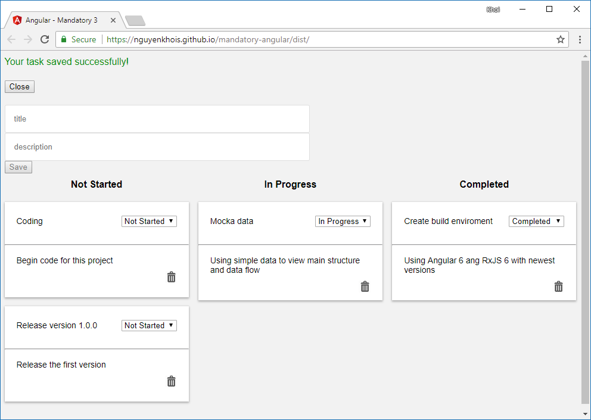

# Angular - Mandatory 3

This project was generated with [Angular CLI](https://github.com/angular/angular-cli) v6.0.3. You may want to know about how you can [start here](ANGULAR.md) and view [online demo here](https://nguyenkhois.github.io/mandatory-angular/dist/).

You may want to view about these things in this project:
* Made with [Angular v6.0.2](https://blog.angular.io/version-6-of-angular-now-available-cc56b0efa7a4)  and [RxJS v6.1.0](https://github.com/ReactiveX/rxjs/blob/master/MIGRATION.md)
* Component interaction (@input, @output, services, OnInit, OnDestroy, ...)
* RxJS ([Observable](http://reactivex.io/rxjs/manual/overview.html#observable), [Observer](http://reactivex.io/rxjs/manual/overview.html#observer), [Subscription](http://reactivex.io/rxjs/manual/overview.html#subscription), [Subject](http://reactivex.io/rxjs/manual/overview.html#subject) -> [BehaviorSubject](http://reactivex.io/rxjs/manual/overview.html#behaviorsubject))
* Re-rendering
* Callback
* [Form validation](https://angular.io/guide/form-validation) (reactive form, built-in validators)

## Screenshot

## References
### Guides
* [Angular services](https://angular.io/tutorial/toh-pt4)
* [Angular - The RxJS Library](https://angular.io/guide/rx-library)
* [Different ways of unsubscribing from RxJS Observables with Angular](https://blog.codecentric.de/en/2018/01/different-ways-unsubscribing-rxjs-observables-angular/)
* [BehaviorSubject vs Observable?](https://stackoverflow.com/questions/39494058/behaviorsubject-vs-observable)

### Deployment
* [Angular - Deployment](https://angular.io/guide/deployment)
* [Angular 5 Deployment - Deploy your Angular App](https://coursetro.com/posts/code/112/Angular-5-Deployment---Deploy-your-Angular-App)